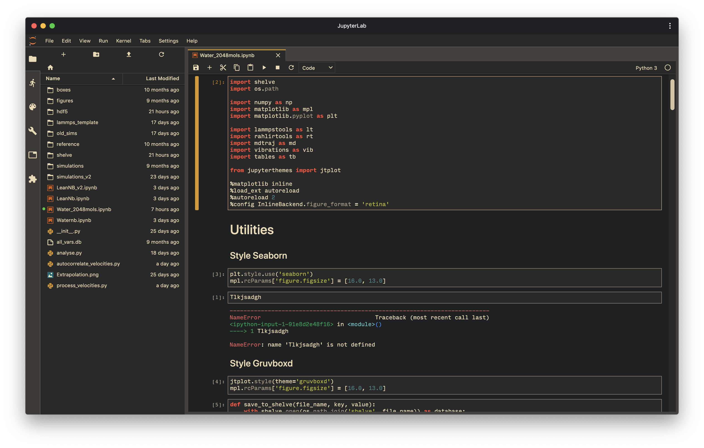

# Gruvbox Theme for Jupyter Lab

[](https://travis-ci.org/Rahlir/theme-gruvbox)

Gruvbox dark theme for Jupyter Lab. Modeled on classic gruvbox color palette and gruvbox theme from [jupyter-themes](https://github.com/dunovank/jupyter-themes).



## Prerequisites

* Jupyter Lab
* node package manager (npm)

## Installation

You do not need to clone this repository to install the theme. It is hosted on npm public registry. Clone only if you want to contribute to [development](#development).

#### Command line install

```bash
jupyter labextension install @rahlir/theme-gruvbox
```

#### GUI install

Alternatively, you can install the gruvbox theme using JupyterLab's new Extension Manager GUI, if you have it enabled. Just open the Extension Manager, enter `@rahlir/theme-gruvbox` in the search bar, and then follow the prompts to install.

You can find instructions for [enabling the Extension Manager
here](https://github.com/jupyterlab/jupyterlab/blob/master/docs/source/user/extensions.rst#using-the-extension-manager).
The Manager was only recently added, so you'll need to have a new enough
version of JupyterLab (version 0.35.0 and above should have it for sure).

## Scrollbars

This is the first JupyterLab extension (that I know of) that styles dark scrollbars correctly on most browsers. With the latest release of Firefox (65), all of the major browsers except for one now support at least some styling of the native scrollbars. The only one left out at this point is Edge. If you're using Edge this theme will still work, but it won't give you the nice dark scrollbars.

See [here](https://developer.mozilla.org/en-US/docs/Web/CSS/::-webkit-scrollbar) and [here](https://developer.mozilla.org/en-US/docs/Web/CSS/CSS_Scrollbars) for more info.

## Development

For a development install (requires npm version 4 or later), do the following in the repository directory:

```bash
npm install
jupyter labextension link .
```

To rebuild the package and the JupyterLab app:

```bash
npm run clean && npm run build
jupyter lab build
```
